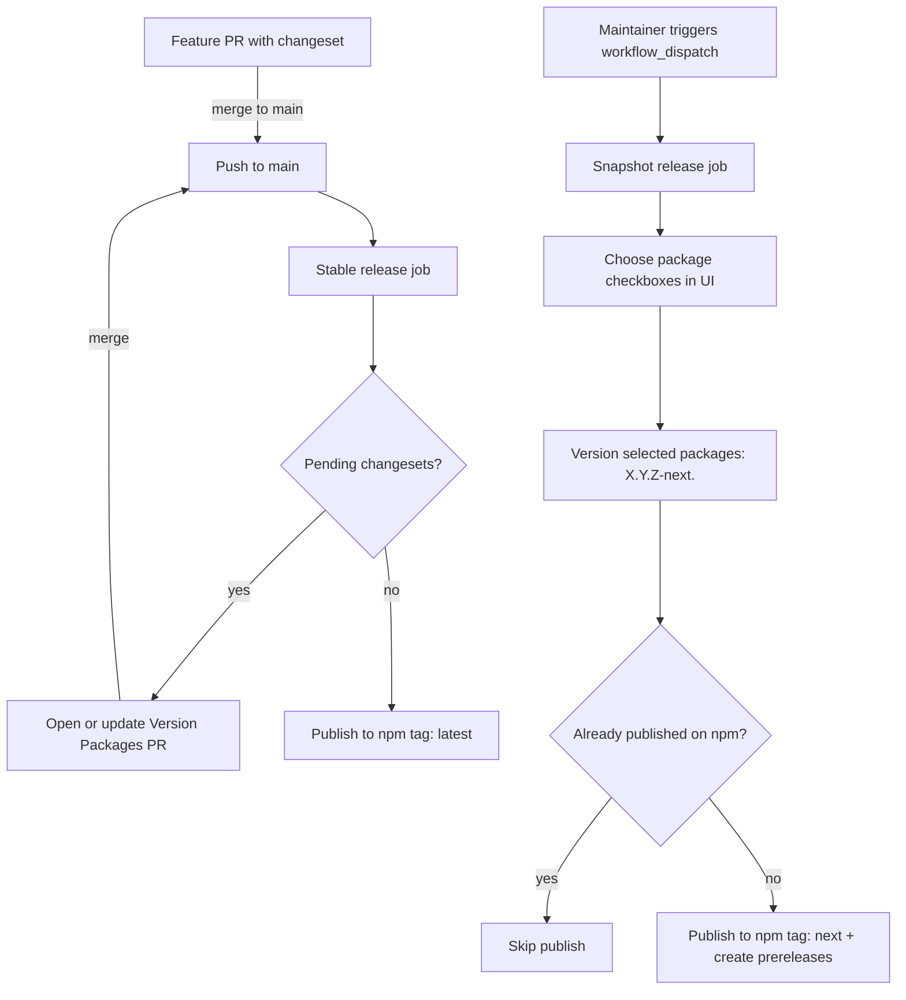

# Contributing to Draft0

First of all, **thank you** for taking the time to consider contributing to Draft0. Every issue, PR, typo fix, or question helps the project — and the ecosystem around it — get better.

Draft0 is an opinionated, zero-configuration toolkit for modern TypeScript projects. That philosophy also shapes how we collaborate: we try to keep things simple, default-driven, and friendly.

## Code of conduct

Draft0 aims to be a welcoming, respectful, and harassment-free community for everyone — regardless of experience level, identity, or background. Be kind, assume good intent, and disagree without getting personal.

This project and everyone participating in it is governed by the [Draft0 Code of Conduct](CODE_OF_CONDUCT.md). By participating, you agree to uphold it. Unacceptable behavior can be reported as described in that document.

## Ways to contribute

You don't have to write code to help. Meaningful contributions include:

- Reporting a bug or confusing behavior.
- Suggesting a new preset, option, or tool.
- Improving docs, examples, or error messages.
- Answering questions in issues and discussions.
- Sharing how you use Draft0 in the wild.
- Reviewing pull requests.

If it's your first time contributing to an open source project, welcome! Look for issues labeled [`help wanted`](https://github.com/arsnl/draft0/issues?q=is%3Aissue+is%3Aopen+label%3A%22help+wanted%22). If nothing fits, open an issue and we'll find something together.

## Asking questions

- **Usage questions, ideas, feedback:** please use [GitHub Discussions](https://github.com/arsnl/draft0/discussions). It keeps the issue tracker focused on actionable work and helps future users find your question.
- **Something feels broken:** open an issue (see below).
- **Security concerns:** see [`SECURITY.md`](SECURITY.md). Please do not open a public issue for security reports.

## Reporting bugs

Before filing a bug:

1. Search [existing issues](https://github.com/arsnl/draft0/issues) to avoid duplicates.
2. Make sure you're on the latest version of the affected `@draft0/*` package.
3. Try to produce a minimal reproduction (a small repo or snippet is gold).

Then open a [bug report](https://github.com/arsnl/draft0/issues/new/choose) using the template. Include:

- Package and version (`@draft0/<name>@x.y.z`).
- Node.js version, package manager, and OS.
- What you expected vs. what happened.
- Reproduction steps (or a link to a minimal repo).

## Suggesting features

Draft0 is intentionally opinionated, so not every feature fits. That's fine — bringing the idea is still valuable. When proposing something:

- Describe the **problem** first, then your preferred solution.
- Mention alternatives you considered.
- Explain how it fits with Draft0's "one good default" philosophy.

Open a [feature request](https://github.com/arsnl/draft0/issues/new/choose) using the template. Not every request will be accepted — sometimes the right answer is "stay in your own config" — but all ideas are read and considered.

## Project layout

```text
.
├── apps/
│   └── docs/            # Documentation site (draft0.dev)
├── packages/
│   ├── oxlint/          # @draft0/oxlint
│   ├── oxfmt/           # @draft0/oxfmt
│   ├── tsdown/          # @draft0/tsdown
│   └── tsconfig/        # @draft0/tsconfig
├── .changeset/          # Pending release notes
├── .github/workflows/   # CI and publish automation
├── turbo.json           # Turborepo pipeline
└── package.json         # Workspace root
```

## Local setup

**Prerequisites**

- Node.js `>=24`
- npm `11.x`
- A GitHub account and git configured locally

**Steps**

1. Fork the repo and clone your fork.

   ```sh
   git clone https://github.com/<your-username>/draft0.git
   cd draft0
   ```

2. Install dependencies:

   ```sh
   npm install
   ```

3. Build the workspace:

   ```sh
   npm run build
   ```

4. Run quality checks:

   ```sh
   npm run check
   ```

5. Auto-fix what can be fixed:

   ```sh
   npm run fix
   ```

## Development workflow

1. **Create a branch from `main`.** Use a short, descriptive name (e.g. `fix/oxlint-react-preset`, `feat/tsconfig-node22`).
2. **Make your change.** Keep commits focused; small, reviewable PRs merge faster.
3. **Add a changeset** (see [Changesets](#changesets)) if your change affects a published package.
4. **Run the checks** locally before pushing.
5. **Open a pull request** against `main`. Fill in the PR template.
6. **Respond to review.** Maintainers aim to be kind, specific, and quick. If you disagree with feedback, say so — discussion is welcome.

Not sure if your idea will be accepted? Open a draft PR or a discussion first. We'd rather talk early than have you invest time on something that won't land.

## Changesets

Every change intended for release should include a [changeset](https://github.com/changesets/changesets) file.

```sh
npx changeset
```

- Select the affected package(s).
- Pick a bump type (`patch`, `minor`, `major`).
- Write a short, user-facing release note (what changed and why — not implementation detail).
- Commit the generated file in `.changeset/` with your PR.

Changes that don't affect a published package (docs, CI, internal refactor, tests) don't need a changeset.

## Pull request expectations

- Keep PRs focused. One logical change per PR.
- Include a changeset for user-facing package changes.
- Make sure the build (`npm run build`), checks (`npm run check`), and tests (`npm test`) are passing before requesting review.
- Update docs / examples if behavior changed.
- Be patient — reviews happen in batches.

We use squash-merge, so your commit history in the PR can be messy; only the final PR title and body end up in `main`.

### Pull request title format

Because Draft0 uses squash-merge, the pull request title becomes the merge commit on `main`.

- Pull request titles follow the [Conventional Commits](https://www.conventionalcommits.org/) specification.
- Required shape: `<type>(<optional scope>)!: <subject>` (scope optional, `!` optional).
- Allowed types: `feat`, `fix`, `docs`, `style`, `refactor`, `perf`, `test`, `build`, `ci`, `chore`, `revert`.
- Allowed scopes (when present): `oxlint`, `oxfmt`, `tsdown`, `tsconfig`, `docs`, `deps`, `release`.
- `release` scope is reserved for release automation and authorized maintainers.
- Package versioning is still driven by [Changesets](#changesets), not by commit type alone.

## Release automation

Releases are automated with [Changesets](https://github.com/changesets/changesets) via a single workflow file: `.github/workflows/publish.yml`.



1. **Stable releases (`push` to `main`)**
   - `publish.yml` runs the stable job automatically on every push to `main`.
   - Uses `changesets/action@v1` to open/update the `Version Packages` PR.
   - When that PR is merged, publishes to npm dist-tag `latest` and creates GitHub Releases.

2. **Snapshot releases (`workflow_dispatch`)**
   - Triggered manually from the GitHub Actions UI by maintainers/admins.
   - You choose which package(s) to include via per-package boolean inputs.
   - The workflow calculates snapshot versions (`X.Y.Z-next.<sha7>`), warns and skips selected packages with no pending changesets, then filters out versions already published on npm.
   - Only unpublished selected versions are published to npm dist-tag `next`, with matching GitHub prereleases.

As a contributor you usually only need to add a changeset. Maintainers handle manual snapshot runs when needed.

## Project lifecycle

Draft0 is in active development. Packages follow [semantic versioning](https://semver.org/):

- `0.x` releases may introduce breaking changes in minor versions.
- Once a package reaches `1.0`, breaking changes are reserved for major versions.
- Deprecations are announced in release notes with at least one minor-version grace period when feasible.

The maintainer works on Draft0 in their own time. Expect best-effort responsiveness, not SLAs.

## Recognition

Contributions of all kinds are recognized. Every merged PR is attributed to its author in the generated changelog and GitHub Release. Thank you for helping Draft0 grow.

## License

By contributing, you agree that your contributions will be licensed under the [MIT License](LICENSE) that covers this project.
